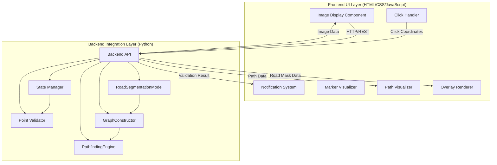
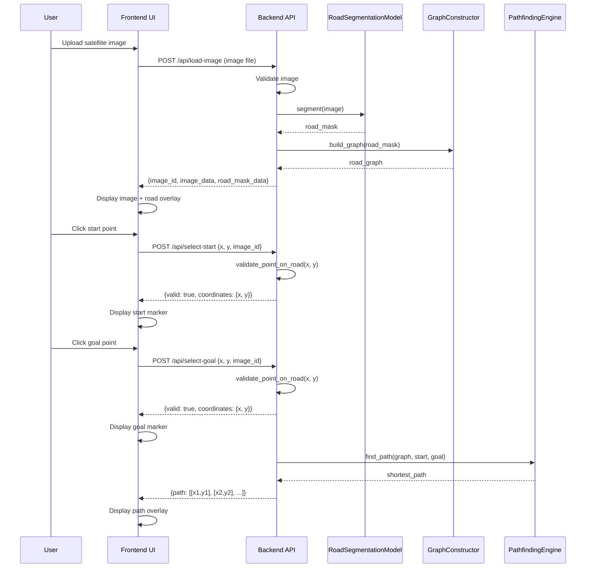

# Design Document: Interactive Road Mapping Interface

## Overview

The Interactive Road Mapping Interface is a web-based UI system that enables users to visualize segmented road networks and interactively select start and goal points for pathfinding. The system is architected with clear separation between the frontend UI layer (HTML/CSS/JavaScript) and the backend integration layer (Python).

The frontend UI provides an intuitive visual interface for displaying satellite images, road overlays, handling user interactions, and visualizing computed paths. The backend integration layer exposes a clean API that wraps the existing RoadSegmentationModel, GraphConstructor, and PathfindingEngine components, managing state and coordinating between these components.

This separation allows the UI to be developed independently by an external agent while maintaining a well-defined contract with the backend processing pipeline.

## Architecture

The system follows a client-server architecture with clear separation between the frontend UI layer and the backend integration layer:



### Layer Responsibilities

**Frontend UI Layer (External Agent)**:
- Display satellite images in a web browser
- Render road overlays with transparency
- Capture and handle mouse click events
- Display start/goal markers
- Visualize computed paths
- Show error messages and notifications
- Manage UI state (selected points, display modes)

**Backend Integration Layer (Python)**:
- Expose REST API endpoints for UI communication
- Load and validate satellite images
- Invoke road segmentation model
- Construct road graphs from segmentation results
- Validate point coordinates against road pixels
- Execute pathfinding algorithms
- Manage backend state (loaded images, graphs, selections)
- Handle errors and return appropriate responses

## Main Workflow



## UI-Backend Interface Contract

This section defines the API contract between the frontend UI and the backend integration layer.

### Base URL

```
http://localhost:5000/api
```

### Endpoints

#### 1. Load and Process Image

**Endpoint**: `POST /api/load-image`

**Request**:
- Content-Type: `multipart/form-data`
- Body: `image` (file upload)

**Response** (Success - 200):
```json
{
  "image_id": "uuid-string",
  "image_data": "base64-encoded-image",
  "road_mask_data": "base64-encoded-mask",
  "width": 1024,
  "height": 768,
  "message": "Image processed successfully"
}
```

**Response** (Error - 400/500):
```json
{
  "error": "Error message description",
  "details": "Additional error details"
}
```

**Backend Behavior**:
- Validate image format and size
- Invoke RoadSegmentationModel
- Construct road graph
- Store state with unique image_id
- Return image and mask data for display

---

#### 2. Select Start Point

**Endpoint**: `POST /api/select-start`

**Request**:
```json
{
  "image_id": "uuid-string",
  "x": 512,
  "y": 384
}
```

**Response** (Valid Point - 200):
```json
{
  "valid": true,
  "coordinates": {"x": 512, "y": 384},
  "message": "Start point selected"
}
```

**Response** (Invalid Point - 400):
```json
{
  "valid": false,
  "error": "Point is not on a road",
  "coordinates": {"x": 512, "y": 384}
}
```

**Backend Behavior**:
- Validate point lies on road pixel in mask
- Update state with start point if valid
- Clear any existing path
- Return validation result

---

#### 3. Select Goal Point

**Endpoint**: `POST /api/select-goal`

**Request**:
```json
{
  "image_id": "uuid-string",
  "x": 256,
  "y": 192
}
```

**Response** (Valid Point with Path - 200):
```json
{
  "valid": true,
  "coordinates": {"x": 256, "y": 192},
  "path": [[512, 384], [500, 380], [256, 192]],
  "message": "Goal point selected and path computed"
}
```

**Response** (Valid Point without Start - 200):
```json
{
  "valid": true,
  "coordinates": {"x": 256, "y": 192},
  "path": null,
  "message": "Goal point selected (no start point yet)"
}
```

**Response** (Invalid Point - 400):
```json
{
  "valid": false,
  "error": "Point is not on a road",
  "coordinates": {"x": 256, "y": 192}
}
```

**Backend Behavior**:
- Validate point lies on road pixel in mask
- If both start and goal are set, compute path using PathfindingEngine
- Return validation result and path (if computed)

---

#### 4. Clear Selection

**Endpoint**: `POST /api/clear-selection`

**Request**:
```json
{
  "image_id": "uuid-string"
}
```

**Response** (200):
```json
{
  "message": "Selection cleared"
}
```

**Backend Behavior**:
- Clear start and goal points from state
- Clear computed path
- Keep image and graph in memory

---

#### 5. Get Current State

**Endpoint**: `GET /api/state/{image_id}`

**Response** (200):
```json
{
  "image_id": "uuid-string",
  "has_image": true,
  "start_point": {"x": 512, "y": 384},
  "goal_point": {"x": 256, "y": 192},
  "path": [[512, 384], [500, 380], [256, 192]]
}
```

**Backend Behavior**:
- Return current state for given image_id
- Useful for UI refresh or reconnection

---

### Data Formats

#### Image Data
- Format: Base64-encoded PNG or JPEG
- Usage: ``

#### Road Mask Data
- Format: Base64-encoded PNG with transparency
- Color: Semi-transparent overlay (e.g., rgba(255, 0, 0, 0.5))
- Usage: Overlay on top of satellite image

#### Path Data
- Format: Array of [x, y] coordinate pairs
- Coordinates: Pixel coordinates in image space
- Usage: Draw polyline connecting points

#### Coordinates
- Origin: Top-left corner (0, 0)
- X-axis: Increases to the right
- Y-axis: Increases downward
- Units: Pixels

---

### Error Handling

**HTTP Status Codes**:
- 200: Success
- 400: Bad request (invalid input, validation failure)
- 404: Resource not found (invalid image_id)
- 500: Internal server error (segmentation failure, pathfinding error)

**Error Response Format**:
```json
{
  "error": "Brief error message",
  "details": "Detailed error information",
  "code": "ERROR_CODE"
}
```

**Common Error Codes**:
- `INVALID_IMAGE`: Image format or size invalid
- `SEGMENTATION_FAILED`: Road segmentation failed
- `GRAPH_CONSTRUCTION_FAILED`: Graph construction failed
- `POINT_NOT_ON_ROAD`: Selected point not on road
- `PATHFINDING_FAILED`: Path computation failed
- `IMAGE_NOT_FOUND`: Invalid image_id
- `INVALID_COORDINATES`: Coordinates out of bounds

---

## Frontend UI Components (External Agent)

The frontend UI layer consists of web-based components built with HTML/CSS/JavaScript. These components communicate with the backend via the REST API defined above.

### Component 1: Image Display Component

**Purpose**: Display the satellite image in the browser

**Responsibilities**:
- Render uploaded satellite image
- Maintain aspect ratio
- Handle image loading states
- Provide canvas or image element for overlays

**Interface**:
```javascript
class ImageDisplay {
  constructor(containerId)
  loadImage(imageData)  // imageData: base64 string
  getImageDimensions()  // returns {width, height}
  getClickCoordinates(event)  // converts click to image coordinates
}
```

---

### Component 2: Overlay Renderer

**Purpose**: Render road mask overlay on top of satellite image

**Responsibilities**:
- Display road mask with transparency
- Blend overlay with base image
- Update overlay when new mask data received

**Interface**:
```javascript
class OverlayRenderer {
  constructor(imageDisplay)
  setRoadMask(maskData)  // maskData: base64 string
  setOpacity(opacity)  // opacity: 0.0 to 1.0
  show()
  hide()
}
```

---

### Component 3: Click Handler

**Purpose**: Capture and process user click events on the map

**Responsibilities**:
- Listen for click events on image
- Convert screen coordinates to image coordinates
- Determine if click is for start or goal point
- Send coordinates to backend API
- Handle API responses

**Interface**:
```javascript
class ClickHandler {
  constructor(imageDisplay, apiClient)
  enableStartSelection()
  enableGoalSelection()
  disable()
  onPointSelected(callback)  // callback(pointType, coordinates, valid)
}
```

---

### Component 4: Marker Visualizer

**Purpose**: Display start and goal point markers on the map

**Responsibilities**:
- Render start marker (e.g., green circle)
- Render goal marker (e.g., red circle)
- Update marker positions
- Clear markers

**Interface**:
```javascript
class MarkerVisualizer {
  constructor(imageDisplay)
  setStartMarker(x, y)
  setGoalMarker(x, y)
  clearStartMarker()
  clearGoalMarker()
  clearAllMarkers()
}
```

---

### Component 5: Path Visualizer

**Purpose**: Display computed shortest path on the map

**Responsibilities**:
- Render path as polyline
- Style path (color, width, opacity)
- Update path when recomputed
- Clear path

**Interface**:
```javascript
class PathVisualizer {
  constructor(imageDisplay)
  setPath(pathCoordinates)  // pathCoordinates: [[x1,y1], [x2,y2], ...]
  setStyle(color, width, opacity)
  clearPath()
}
```

---

### Component 6: Notification System

**Purpose**: Display messages, errors, and status updates to user

**Responsibilities**:
- Show success messages
- Show error messages
- Show loading indicators
- Auto-dismiss or require user acknowledgment

**Interface**:
```javascript
class NotificationSystem {
  constructor(containerId)
  showSuccess(message)
  showError(message)
  showInfo(message)
  showLoading(message)
  hideLoading()
  clear()
}
```

---

### Component 7: API Client

**Purpose**: Handle all HTTP communication with backend

**Responsibilities**:
- Make API requests
- Handle responses and errors
- Parse JSON data
- Manage request state

**Interface**:
```javascript
class APIClient {
  constructor(baseUrl)
  async loadImage(imageFile)
  async selectStart(imageId, x, y)
  async selectGoal(imageId, x, y)
  async clearSelection(imageId)
  async getState(imageId)
}
```

---

### UI Workflow

1. User uploads image via file input
2. ImageDisplay shows loading state
3. APIClient sends image to backend
4. Backend processes and returns image_id, image_data, road_mask_data
5. ImageDisplay renders satellite image
6. OverlayRenderer renders road mask overlay
7. ClickHandler enables start point selection
8. User clicks on map
9. ClickHandler converts click to coordinates, sends to backend
10. Backend validates point, returns result
11. If valid: MarkerVisualizer displays start marker, ClickHandler enables goal selection
12. If invalid: NotificationSystem shows error message
13. User clicks goal point
14. Backend validates, computes path, returns result
15. MarkerVisualizer displays goal marker
16. PathVisualizer displays computed path

---

## Backend Integration Components (Python)

The backend integration layer exposes a REST API and coordinates between existing components.

### Component 1: Backend API (Flask/FastAPI)

**Purpose**: Expose REST endpoints for UI communication

**Responsibilities**:
- Handle HTTP requests
- Route requests to appropriate handlers
- Serialize/deserialize JSON
- Return HTTP responses
- Handle CORS for browser access

**Interface**:
```python
class BackendAPI:
    def __init__(self, state_manager, segmentation_model, graph_constructor, pathfinding_engine):
        pass
    
    def run(self, host='localhost', port=5000):
        pass
    
    # Route handlers
    def load_image_handler(self, request):
        pass
    
    def select_start_handler(self, request):
        pass
    
    def select_goal_handler(self, request):
        pass
    
    def clear_selection_handler(self, request):
        pass
    
    def get_state_handler(self, image_id):
        pass
```

---

### Component 2: State Manager

**Purpose**: Manage backend state for loaded images, graphs, and selections

**Responsibilities**:
- Store loaded images and metadata
- Store road masks and graphs
- Store start/goal point selections
- Store computed paths
- Provide state access and updates
- Clean up old sessions

**Interface**:
```python
class StateManager:
    def create_session(self, image_id: str, image: np.ndarray, road_mask: np.ndarray, graph: Graph) -> None:
        pass
    
    def get_session(self, image_id: str) -> dict:
        pass
    
    def set_start_point(self, image_id: str, x: int, y: int) -> None:
        pass
    
    def set_goal_point(self, image_id: str, x: int, y: int) -> None:
        pass
    
    def set_path(self, image_id: str, path: List[Tuple[int, int]]) -> None:
        pass
    
    def clear_selection(self, image_id: str) -> None:
        pass
    
    def session_exists(self, image_id: str) -> bool:
        pass
```

---

### Component 3: Point Validator

**Purpose**: Validate that click coordinates lie on road pixels

**Responsibilities**:
- Check if coordinates are within image bounds
- Check if coordinates correspond to road pixel in mask
- Return validation result

**Interface**:
```python
class PointValidator:
    def validate_point(self, road_mask: np.ndarray, x: int, y: int) -> bool:
        """
        Validate that point (x, y) lies on a road pixel.
        
        Preconditions:
        - road_mask is a valid binary mask (0 or 255 values)
        - x and y are integers
        
        Postconditions:
        - Returns True if and only if:
          - 0 <= x < road_mask.width
          - 0 <= y < road_mask.height
          - road_mask[y, x] > 0 (road pixel)
        - Returns False otherwise
        """
        pass
```

---

### Component 4: Image Processor

**Purpose**: Handle image loading, validation, and encoding

**Responsibilities**:
- Load image from file upload
- Validate image format and size
- Convert image to numpy array
- Encode image/mask to base64 for API response
- Decode base64 to numpy array

**Interface**:
```python
class ImageProcessor:
    def load_image(self, file_data: bytes) -> np.ndarray:
        pass
    
    def validate_image(self, image: np.ndarray) -> bool:
        pass
    
    def encode_image_to_base64(self, image: np.ndarray) -> str:
        pass
    
    def encode_mask_to_base64(self, mask: np.ndarray, opacity: float = 0.5) -> str:
        pass
```

---

### Component 5: Pathfinding Coordinator

**Purpose**: Coordinate pathfinding execution and handle errors

**Responsibilities**:
- Invoke PathfindingEngine with graph and points
- Handle pathfinding errors
- Convert path format for API response
- Validate path results

**Interface**:
```python
class PathfindingCoordinator:
    def __init__(self, pathfinding_engine: PathfindingEngine):
        pass
    
    def compute_path(self, graph: Graph, start: Tuple[int, int], goal: Tuple[int, int]) -> List[Tuple[int, int]]:
        """
        Compute shortest path between start and goal.
        
        Preconditions:
        - graph is a valid road graph
        - start and goal are valid coordinates on road pixels
        
        Postconditions:
        - Returns list of (x, y) coordinates forming path from start to goal
        - Path[0] == start
        - Path[-1] == goal
        - All intermediate points are on roads
        - Raises PathfindingError if no path exists
        """
        pass
```

---

### Backend Workflow

1. Flask/FastAPI server starts and listens on port 5000
2. UI sends POST /api/load-image with image file
3. ImageProcessor loads and validates image
4. RoadSegmentationModel segments image to produce road mask
5. GraphConstructor builds graph from road mask
6. StateManager creates session with unique image_id
7. ImageProcessor encodes image and mask to base64
8. API returns response with image_id, image_data, road_mask_data
9. UI sends POST /api/select-start with coordinates
10. PointValidator validates coordinates against road mask
11. If valid: StateManager stores start point, API returns success
12. If invalid: API returns error response
13. UI sends POST /api/select-goal with coordinates
14. PointValidator validates coordinates
15. If valid and start exists: PathfindingCoordinator computes path
16. StateManager stores goal point and path
17. API returns success with path data


---

## Implementation Considerations

### Frontend Technology Stack

**Recommended Technologies**:
- HTML5 Canvas for image display and overlays
- Vanilla JavaScript or lightweight framework (React, Vue)
- CSS for styling and layout
- Fetch API or Axios for HTTP requests

**Key Implementation Details**:
- Use HTML5 Canvas for precise coordinate mapping and overlay rendering
- Implement debouncing for click events to prevent double-clicks
- Cache image_id in browser session storage
- Handle image scaling and viewport transformations
- Implement responsive design for different screen sizes

### Backend Technology Stack

**Recommended Technologies**:
- Flask or FastAPI for REST API
- Flask-CORS for cross-origin requests
- UUID for session management
- Base64 encoding for image transmission
- In-memory state storage (dict) or Redis for production

**Key Implementation Details**:
- Use Flask-CORS to enable browser access
- Implement session timeout and cleanup
- Use numpy for efficient image operations
- Cache segmentation results to avoid reprocessing
- Implement proper error handling and logging
- Consider async processing for large images

### Deployment Considerations

**Development Setup**:
- Frontend: Serve static files or use development server (e.g., `python -m http.server`)
- Backend: Run Flask/FastAPI on localhost:5000
- CORS: Enable for localhost during development

**Production Setup**:
- Frontend: Deploy to static hosting (Nginx, Apache, CDN)
- Backend: Deploy to application server (Gunicorn, uWSGI)
- CORS: Configure for production domain
- State: Use Redis or database for persistent state
- Security: Add authentication, rate limiting, input validation

### Performance Optimization

**Image Processing**:
- Resize large images before processing
- Use efficient image encoding (JPEG for photos, PNG for masks)
- Implement progressive loading for large images

**API Response Time**:
- Cache segmentation results
- Pre-compute graph during image load
- Use async processing for long operations
- Return immediate response with status endpoint for polling

**Frontend Rendering**:
- Use requestAnimationFrame for smooth animations
- Implement virtual scrolling for large images
- Debounce resize events
- Use Web Workers for heavy computations

---

## Correctness Properties

*A property is a characteristic or behavior that should hold true across all valid executions of a system—essentially, a formal statement about what the system should do. Properties serve as the bridge between human-readable specifications and machine-verifiable correctness guarantees.*

### Property 1: Image Display Preservation

*For any* valid satellite image loaded via POST /api/load-image, the backend should return image_data that preserves the original aspect ratio and resolution.

**Validates: Requirements 1.1, 1.2**

### Property 2: Invalid Image Rejection

*For any* invalid or corrupted image file uploaded to POST /api/load-image, the backend should return a 400 error response with error code INVALID_IMAGE.

**Validates: Requirement 1.3**

### Property 3: Segmentation Invocation

*For any* valid satellite image uploaded to POST /api/load-image, the backend should automatically invoke RoadSegmentationModel and return road_mask_data in the response.

**Validates: Requirements 2.1, 2.2**

### Property 4: Road Overlay Transparency

*For any* road_mask_data returned by the backend, the frontend OverlayRenderer should render it with semi-transparent coloring that preserves visibility of the underlying satellite image.

**Validates: Requirements 3.1, 3.2**

### Property 5: Graph Construction Trigger

*For any* road mask generated by segmentation during POST /api/load-image, the backend should automatically invoke GraphConstructor and store the resulting road graph in StateManager.

**Validates: Requirements 4.1, 4.2**

### Property 6: Point Validation

*For any* coordinates (x, y) sent to POST /api/select-start or POST /api/select-goal, the backend PointValidator should validate whether the point lies on a road pixel in the road mask.

**Validates: Requirements 5.2, 6.2**

### Property 7: Valid Point Acceptance

*For any* coordinates that lie on a road pixel, the backend should return {valid: true} and update the StateManager with the selected point.

**Validates: Requirements 5.3, 6.3**

### Property 8: Invalid Point Rejection

*For any* coordinates that do not lie on a road pixel, the backend should return {valid: false, error: "Point is not on a road"} with HTTP status 400.

**Validates: Requirements 5.4, 6.4**

### Property 9: Point Marker Display

*For any* valid point selection response with {valid: true}, the frontend MarkerVisualizer should display a marker at the returned coordinates.

**Validates: Requirements 5.5, 6.5**

### Property 10: Click Event Capture

*For any* user click on the displayed map, the frontend ClickHandler should capture the click coordinates and send them to the appropriate backend endpoint.

**Validates: Requirements 5.1, 6.1**

### Property 11: Pathfinding Invocation

*For any* POST /api/select-goal request where both start and goal points are valid and set, the backend should automatically invoke PathfindingEngine and return the computed path in the response.

**Validates: Requirements 7.1, 7.2**

### Property 12: Path Overlay Display

*For any* API response containing a non-null path array, the frontend PathVisualizer should display the path as a colored polyline overlay on the map.

**Validates: Requirement 8.1**

### Property 13: Point Reselection and Path Clearing

*For any* reselection of start or goal points after both have been set, the backend should clear the previous path from StateManager and recompute a new path if both points remain valid.

**Validates: Requirements 9.1, 9.2, 9.3**

### Property 14: Component Failure Error Handling

*For any* component failure during backend processing (segmentation, graph construction, or pathfinding), the backend should return an appropriate HTTP error status (500) with a descriptive error message and error code.

**Validates: Requirements 2.3, 4.3, 7.4, 11.1**

### Property 15: Invalid Action Feedback

*For any* invalid user action (e.g., clicking off-road), the frontend NotificationSystem should display immediate visual feedback based on the backend error response.

**Validates: Requirement 11.2**

### Property 16: Error Logging

*For any* error that occurs during backend operation, the backend should log the error with sufficient detail (timestamp, error type, stack trace) for debugging purposes.

**Validates: Requirement 11.3**

### Property 17: Recoverable Error Retry

*For any* recoverable error condition (e.g., segmentation failure), the frontend should provide UI options for the user to retry the operation or upload a different image.

**Validates: Requirements 2.3, 11.4**

### Property 18: API Response Format Consistency

*For any* API endpoint response, the backend should return JSON data conforming to the documented response schema for that endpoint.

**Validates: API Contract**

### Property 19: State Consistency

*For any* image_id, the StateManager should maintain consistent state such that GET /api/state/{image_id} returns the current start point, goal point, and path that match the most recent successful POST requests.

**Validates: State Management**

### Property 20: Coordinate System Consistency

*For any* coordinates exchanged between frontend and backend, both layers should use the same coordinate system (origin at top-left, x increases right, y increases down, units in pixels).

**Validates: Data Format Contract**
